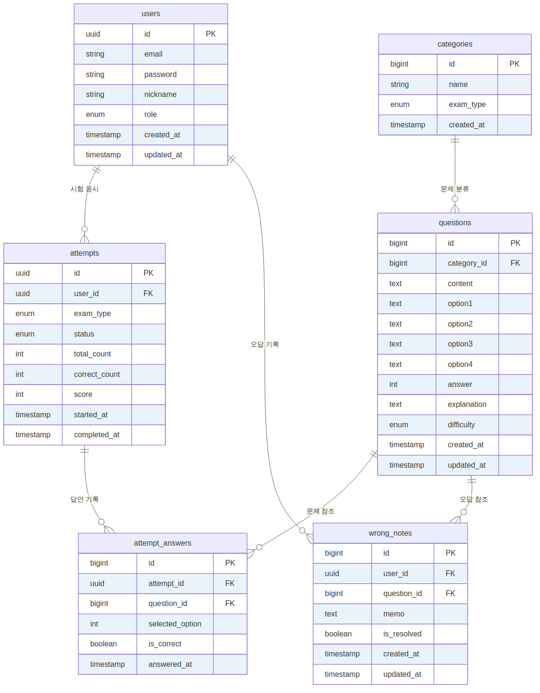

# SQLD/SQLP 문제은행


SQLD/SQLP 자격증 시험 대비 문제은행 웹 애플리케이션.  
랜덤 문제 출제, 자동 채점, 오답노트, 통계 분석 기능을 제공한다.

---

## 주요 기능

| 기능 | 설명 |
|------|------|
| 회원 인증 | JWT Access Token(15분) + Refresh Token(7일) Rotation |
| 문제 풀기 | SQLD/SQLP 랜덤 출제, 카테고리·난이도 필터 |
| 자동 채점 | 제출 즉시 채점 및 점수 계산 |
| 오답노트 | 틀린 문제 메모, 해결 여부 관리 |
| 통계 | 카테고리별 정답률, 취약점 분석, 시험 이력 |

---

## 기술 스택

### Backend
| 항목 | 기술 |
|------|------|
| Language | Java 21 |
| Framework | Spring Boot 3.3.5 |
| Build | Gradle (Groovy) |
| ORM | Spring Data JPA + Hibernate |
| Security | Spring Security + JWT (jjwt 0.12.6) |
| DB Migration | Flyway |
| Cache | Redis 7 |
| API 문서 | Springdoc OpenAPI (Swagger) |
| 모니터링 | Spring Actuator + Prometheus |
| 쿼리 모니터링 | P6Spy |
| Rate Limiting | Bucket4j |
| 로깅 | Logback + MDC |

### Frontend
| 항목 | 기술 |
|------|------|
| Framework | React 18 + TypeScript |
| Build | Vite |
| 상태관리 | Zustand + React Query |
| 스타일 | Tailwind CSS |
| 라우팅 | React Router v6 |

### Infrastructure
| 항목 | 기술 |
|------|------|
| DB | PostgreSQL 16 |
| Cache | Redis 7 |
| Container | Docker + Docker Compose |
| CI/CD | Jenkins |
| 모니터링 | Prometheus + Grafana |
| 배포 | 로컬 서버 → AWS (EC2 + RDS + ElastiCache) |

---

## ERD



| 테이블 | 설명 |
|--------|------|
| `users` | 회원 (UUID PK, role: USER\|ADMIN) |
| `categories` | 문제 분류 (exam_type: SQLD\|SQLP) |
| `questions` | 문제 (4지선다, 난이도: EASY\|MEDIUM\|HARD) |
| `attempts` | 시험 세션 (UUID PK, 채점 결과 포함) |
| `attempt_answers` | 문항별 답안 기록 |
| `wrong_notes` | 오답노트 (메모, 해결 여부) |

---

## API 개요

### 공통 응답 포맷

```json
// 성공
{ "success": true, "message": "OK", "data": {} }

// 실패
{ "success": false, "message": "문제를 찾을 수 없습니다.", "data": null }
```

### 엔드포인트

| 도메인 | Method | URI | 설명 |
|--------|--------|-----|------|
| 인증 | POST | `/api/v1/auth/signup` | 회원가입 |
| 인증 | POST | `/api/v1/auth/login` | 로그인 |
| 인증 | POST | `/api/v1/auth/reissue` | 토큰 재발급 |
| 인증 | POST | `/api/v1/auth/logout` | 로그아웃 |
| 문제 | GET | `/api/v1/questions` | 문제 목록 (필터: category, difficulty, exam_type) |
| 문제 | GET | `/api/v1/questions/{id}` | 문제 상세 |
| 문제 | POST | `/api/v1/questions` | 문제 등록 `[ADMIN]` |
| 시험 | POST | `/api/v1/exams` | 시험 시작 (랜덤 출제) |
| 시험 | POST | `/api/v1/exams/{id}/submit` | 제출 + 자동 채점 |
| 시험 | GET | `/api/v1/exams/{id}/result` | 채점 결과 |
| 오답노트 | GET | `/api/v1/wrong-notes` | 오답노트 목록 |
| 오답노트 | PATCH | `/api/v1/wrong-notes/{id}/resolve` | 해결 처리 |
| 통계 | GET | `/api/v1/statistics/summary` | 전체 통계 요약 |
| 통계 | GET | `/api/v1/statistics/weak-points` | 취약점 분석 |

> 전체 API 문서: 앱 실행 후 `http://localhost:8080/swagger-ui.html`

---

## 로컬 실행 방법

### 사전 요구사항
- Java 21
- Docker Desktop

### 실행

```bash
# 1. 환경변수 설정
cp .env.example .env   # DB_USER, DB_PASSWORD 입력

# 2. 인프라 기동 (PostgreSQL + Redis)
docker compose up -d

# 3. 애플리케이션 실행
./gradlew bootRun --args='--spring.profiles.active=local'

# 4. 헬스 확인
curl http://localhost:8080/actuator/health
# → {"status":"UP"}
```

> Docker 없이 실행 시: `local` 프로파일이 H2 인메모리 DB를 사용하므로 Docker 없이도 앱 기동 가능.  
> H2 콘솔: `http://localhost:8080/h2-console`

---

## 브랜치 전략

```
main        ← 배포 가능 상태 (Jenkins 트리거)
develop     ← 기능 통합
feature/xxx ← 기능 개발
hotfix/xxx  ← 긴급 수정
```

- PR은 항상 `develop` 타겟으로 생성
- `main` 직접 push 금지

## 커밋 컨벤션

| type | 용도 |
|------|------|
| `feat` | 새 기능 |
| `fix` | 버그 수정 |
| `refactor` | 리팩토링 |
| `test` | 테스트 코드 |
| `docs` | 문서 |
| `chore` | 빌드/설정 변경 |
